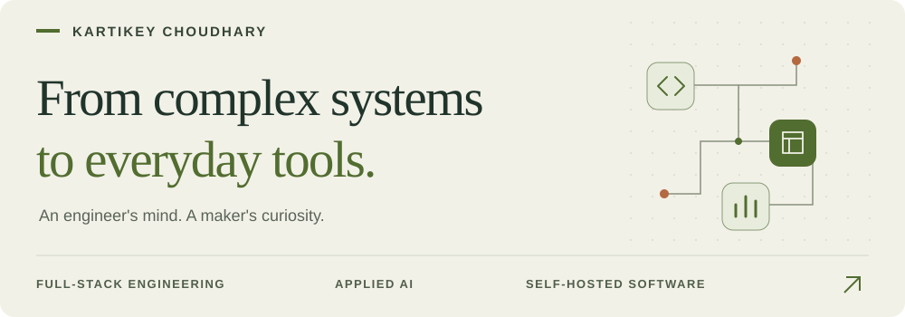

<picture>
  <source media="(prefers-color-scheme: dark)" srcset="assets/header-dark.svg">
  <source media="(prefers-color-scheme: light)" srcset="assets/header-light.svg">
  
</picture>

# Hi, I'm Kartikey.

I'm a **Senior Software Engineer** building products with **Java, Spring Boot, and Angular**. My work spans hospitality, enterprise analytics, and fintech tooling. Outside that, I build software for everyday problems: managing money, organizing a workspace, and making AI useful in the development process.

[Portfolio](https://kartikeychoudhary.com) &nbsp; / &nbsp; [LinkedIn](https://www.linkedin.com/in/kartikeychoudhary/) &nbsp; / &nbsp; [Email](mailto:kartikey31choudhary@gmail.com) &nbsp; / &nbsp; [Hugging Face](https://huggingface.co/kartikey31/txn-parser)

## What I'm building around

- **AI with verifiable results.** Development workflows with explicit review gates, and small models that turn transaction text into structured data.
- **Software you can own.** Self-hosted tools, local storage, and useful interfaces for personal finance and daily routines.
- **Care across the stack.** From API contracts and data models to the details of a dashboard. TDD, clean architecture, and considered UI design.

## Selected builds

<table>
  <tr>
    <td width="50%" valign="top">
      <h3><a href="https://github.com/kartikeychoudhary/copilot_workforce">Copilot Workforce ↗</a></h3>
      
A development workflow that takes a Jira story through planning, implementation, and review, with seven evidence gates and a growing project knowledge base.

      
DEVELOPER TOOLS · COPILOT · PYTHON

      
Also: <a href="https://github.com/kartikeychoudhary/ai_workforce">AI Workforce</a>, the portable CLI workflow it builds on.

    </td>
    <td width="50%" valign="top">
      <h3><a href="https://github.com/kartikeychoudhary/txn-parser">Transaction Parser ↗</a></h3>
      
Distilling small language models to turn voice-transcribed expenses into structured JSON. Training, evaluation, and GGUF exports for use on a device.

      
APPLIED AI · PYTHON · LORA · LLAMA.CPP

      
<a href="https://huggingface.co/kartikey31/txn-parser">Explore the published models</a>

    </td>
  </tr>
  <tr>
    <td width="50%" valign="top">
      <h3><a href="https://github.com/kartikeychoudhary/minted">Minted ↗</a></h3>
      
A personal finance app for accounts, budgets, transactions, and spending analytics. A full stack project with statement imports and Docker deployment.

      
PERSONAL FINANCE · ANGULAR · SPRING BOOT · MYSQL

      
<a href="https://github.com/kartikeychoudhary/minted/blob/main/screenshots/README.md">See the interface</a>

    </td>
    <td width="50%" valign="top">
      <h3><a href="https://github.com/kartikeychoudhary/OnTrackTab">ZenBoard / OnTrackTab ↗</a></h3>
      
A calmer Chrome new tab with bookmark search, notes, weather, and a customizable widget layout. Settings and workspace preferences stay local.

      
BROWSER EXTENSION · REACT · TYPESCRIPT

      
<a href="https://github.com/kartikeychoudhary/OnTrackTab#screenshots">See the workspace</a>

    </td>
  </tr>
  <tr>
    <td width="50%" valign="top">
      <h3><a href="https://github.com/kartikeychoudhary/Catalogue">Angular Catalogue ↗</a></h3>
      
Three component libraries exploring Swiss editorial, neo-brutalist, and glassmorphic design, each with a working Angular demo.

      
UI SYSTEMS · ANGULAR · CSS

      
<a href="https://kartikeychoudhary.github.io/Catalogue/catalogue1/">Swiss</a> · <a href="https://kartikeychoudhary.github.io/Catalogue/catalogue2/">Brutalist</a> · <a href="https://kartikeychoudhary.github.io/Catalogue/catalogue3/">Glass</a>

    </td>
    <td width="50%" valign="top">
      <h3><a href="https://github.com/kartikeychoudhary/kairos-screenshots">Kairos ↗</a></h3>
      
A self-hosted research workbench for Indian equities, with report workflows, charts, and factor breakdowns. A look at how I design interfaces for complex data.

      
RESEARCH TOOLS · DATA VISUALIZATION

      
<a href="https://github.com/kartikeychoudhary/kairos-screenshots#contents">Public interface gallery</a> · App source is private; screenshots use placeholder data.

    </td>
  </tr>
</table>

## Tools I reach for

| Area | Toolkit |
| :--- | :--- |
| **Backend** | Java · Spring Boot · Python · FastAPI · Node.js |
| **Interfaces** | Angular · TypeScript · React · Flutter · Tailwind CSS |
| **Data & deployment** | PostgreSQL · MySQL · SQLite · Docker · Nginx · GitHub Actions |
| **Applied AI** | Model distillation · LoRA fine-tuning · GGUF · llama.cpp · Agent workflows |

---

Interested in thoughtful tools, practical AI, or building across the stack? [Let's connect.](mailto:kartikey31choudhary@gmail.com)
