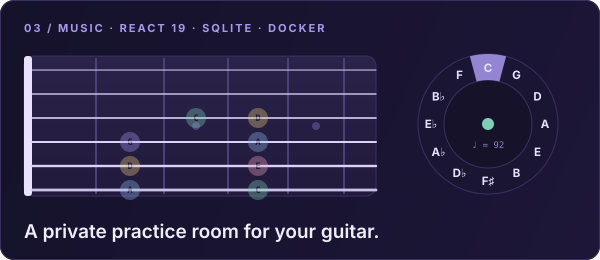
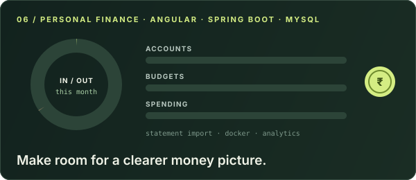
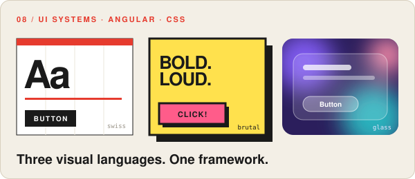

<picture>
  <source media="(prefers-color-scheme: dark)" srcset="assets/hero-dark.svg">
  <source media="(prefers-color-scheme: light)" srcset="assets/hero-light.svg">
  
</picture>

  <a href="https://kartikeychoudhary.com"><b>Portfolio</b></a> &nbsp;·&nbsp;
  <a href="https://www.linkedin.com/in/kartikeychoudhary/"><b>LinkedIn</b></a> &nbsp;·&nbsp;
  <a href="mailto:kartikey31choudhary@gmail.com"><b>Email</b></a> &nbsp;·&nbsp;
  <a href="https://huggingface.co/kartikey31/txn-parser"><b>Hugging Face</b></a> &nbsp;·&nbsp;
  <a href="https://komorebi.kartikey.cv/"><b>Take a ride on Komorebi ↗</b></a>



## Hi, I'm Kartikey.

I'm a **Senior Software Engineer** who works the whole round trip: the schema, the API contract, the Android screen, the container it ships in, and the small animation that makes it feel finished. By day that means **Java, Spring Boot, and Angular** across hospitality, enterprise analytics, and fintech tooling.

After hours I build the software I want to live with: an expense tracker that reads my bank SMS without ever touching a server, a metro carriage that plays my music in the rain, a practice room for my guitar, and the console I use to deploy all of it to my own hardware.

 

<a href="#paisa-trail"></a>

### Paisa Trail

A private Android expense tracker that turns the SMS your banks already send into an **encrypted, on-device ledger**. Budgets with 80% and 100% alerts, splits with friends and Splitwise sync, foreign spends at ECB reference rates, a review queue for anything the parser doubts, and a home-screen widget. No bank login, no account aggregator, no analytics. An optional AI reader sees only masked text.

ANDROID · KOTLIN · JETPACK COMPOSE · SQLCIPHER · SELF-HOSTED SPLITWISE BRIDGE (TYPESCRIPT · DOCKER) &nbsp; Source is private for now.

## Selected builds

<table>
  <tr>
    <td width="50%" valign="top">
      <a href="https://komorebi.kartikey.cv/"></a>
      <h3><a href="https://komorebi.kartikey.cv/">Komorebi 木漏れ日 ↗</a></h3>
      
An illustrated metro carriage for the screen beside your day. Six landscapes, 17 lines from Delhi to Tokyo, passengers who board and leave, rain on the glass, synced lyrics, and your own Spotify through PKCE. Rendered as a native 4K canvas scene.

      
IMMERSIVE WEB · REACT · VINEXT · CANVAS · SPOTIFY · DOCKER

      
<a href="https://komorebi.kartikey.cv/">Take the ride</a>

    </td>
    <td width="50%" valign="top">
      <a href="https://hub.docker.com/r/kartikey31choudhary/tabbook"></a>
      <h3><a href="https://hub.docker.com/r/kartikey31choudhary/tabbook">Tabbook ↗</a></h3>
      
A self-hosted practice room for guitar: a song library, section-by-section practice with loops and a metronome, 420 chord formulas, an interactive circle of fifths, and JSON/CSV import from your favourite AI tool. Everything lives in your own SQLite file.

      
MUSIC · REACT 19 · TYPESCRIPT · SQLITE · DOCKER

      
<a href="https://hub.docker.com/r/kartikey31choudhary/tabbook">Pull the image</a>

    </td>
  </tr>
  <tr>
    <td width="50%" valign="top">
      
      <h3>Portside</h3>
      
A single-operator deployment console. Upload a ZIP or build a private Git repo in an isolated Docker runner, inspect preflight checks, then publish to your own server, Cloudflare Pages, or GitHub Pages. Previews, pinned releases, and one-click rollback.

      
DEVOPS · ANGULAR · NODE.JS · TYPESCRIPT · SQLITE · DOCKER

      
Source is private for now.

    </td>
    <td width="50%" valign="top">
      <a href="https://github.com/kartikeychoudhary/txn-parser"></a>
      <h3><a href="https://github.com/kartikeychoudhary/txn-parser">Transaction Parser ↗</a></h3>
      
Distilling small language models that turn voice-transcribed expenses into structured JSON. Training, evaluation, and GGUF exports small enough to run on a phone.

      
APPLIED AI · PYTHON · LORA · LLAMA.CPP

      
<a href="https://huggingface.co/kartikey31/txn-parser">Explore the published models</a>

    </td>
  </tr>
  <tr>
    <td width="50%" valign="top">
      <a href="https://github.com/kartikeychoudhary/minted"></a>
      <h3><a href="https://github.com/kartikeychoudhary/minted">Minted ↗</a></h3>
      
A personal finance app for accounts, budgets, transactions, and spending analytics. Full stack, with statement imports and Docker deployment.

      
PERSONAL FINANCE · ANGULAR · SPRING BOOT · MYSQL

      
<a href="https://github.com/kartikeychoudhary/minted/blob/main/screenshots/README.md">See the interface</a>

    </td>
    <td width="50%" valign="top">
      <a href="https://github.com/kartikeychoudhary/OnTrackTab"></a>
      <h3><a href="https://github.com/kartikeychoudhary/OnTrackTab">ZenBoard / OnTrackTab ↗</a></h3>
      
A calmer Chrome new tab with bookmark search, notes, weather, and a customizable widget layout. Settings and workspace preferences stay local.

      
BROWSER EXTENSION · REACT · TYPESCRIPT

      
<a href="https://github.com/kartikeychoudhary/OnTrackTab#screenshots">See the workspace</a>

    </td>
  </tr>
  <tr>
    <td width="50%" valign="top">
      <a href="https://github.com/kartikeychoudhary/Catalogue"></a>
      <h3><a href="https://github.com/kartikeychoudhary/Catalogue">Angular Catalogue ↗</a></h3>
      
Three component libraries exploring Swiss editorial, neo-brutalist, and glassmorphic design, each with a working Angular demo.

      
UI SYSTEMS · ANGULAR · CSS

      
<a href="https://kartikeychoudhary.github.io/Catalogue/catalogue1/">Swiss</a> · <a href="https://kartikeychoudhary.github.io/Catalogue/catalogue2/">Brutalist</a> · <a href="https://kartikeychoudhary.github.io/Catalogue/catalogue3/">Glass</a>

    </td>
    <td width="50%" valign="top">
      <a href="https://github.com/kartikeychoudhary/kairos-screenshots"></a>
      <h3><a href="https://github.com/kartikeychoudhary/kairos-screenshots">Kairos ↗</a></h3>
      
A self-hosted research workbench for Indian equities, with report workflows, charts, and factor breakdowns. A look at how I design interfaces for dense data.

      
RESEARCH TOOLS · ANGULAR · FASTAPI · POSTGRESQL

      
<a href="https://github.com/kartikeychoudhary/kairos-screenshots#contents">Public interface gallery</a> · App source is private; screenshots use placeholder data.

    </td>
  </tr>
</table>

## How I work across the stack



- **AI with verifiable results.** Small models that turn messy text into structured data, and development workflows with explicit review gates.
- **Software you can own.** Self-hosted tools, local and encrypted storage, and nothing phoning home unless you switch it on.
- **Care across the stack.** From API contracts and data models to the last detail of a dashboard. TDD, clean architecture, and considered UI design.

## Tools I reach for

**Backend**

  
  
  
  
  
  

**Interfaces**

  
  
  
  

**Mobile**

  
  
  

**Data & deployment**

  
  
  
  
  
  
  

**Applied AI**

  
  
  
  
  

Into thoughtful tools, practical AI, or building across the whole stack? <a href="mailto:kartikey31choudhary@gmail.com"><b>Let's talk.</b></a>

